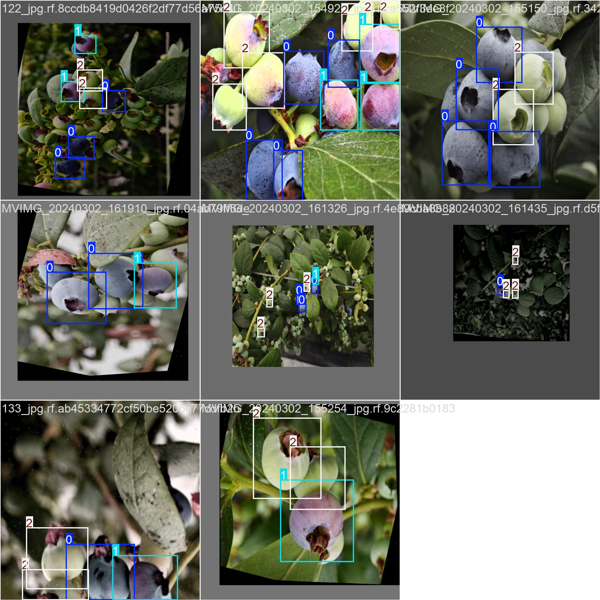

# 蓝莓成熟度检测系统

<p align="center">
  
</p>

<p align="center"><strong>YOLO 训练批次样例图：蓝莓成熟度标注数据预览</strong></p>

基于 Flask、ONNX Runtime 和前端原生 HTML/CSS/JavaScript 的蓝莓成熟度检测网页系统。系统支持蓝莓图片上传、模型推理、检测框可视化、成熟度数量统计、历史记录管理、用户权限管理和 ONNX 模型切换，适用于智慧农业实训、模型演示和检测流程验证。

## 功能特性

- 用户登录、注册和 Session 会话管理
- 管理员与普通用户两类角色权限
- 单张图片成熟度检测与检测框标注
- 多图片批量检测与汇总统计
- 大图滑窗裁剪、分块检测和坐标重建
- 检测记录查询、详情查看和 CSV 下载
- 管理后台数据统计、用户管理、记录管理
- ONNX 模型上传、激活和切换

## 识别类别

| 类别标识 | 中文含义 |
| --- | --- |
| `RipeBlueBerry` | 成熟蓝莓 |
| `Semi-RipeBlueBerry` | 半熟蓝莓 |
| `UnripeBlueBerry` | 未熟蓝莓 |

## 技术栈

- 后端：Flask 3.1、Werkzeug
- 推理：ONNX Runtime、NumPy、Pillow、OpenCV
- 数据库：SQLite
- 前端：HTML5、CSS3、JavaScript
- 模型格式：ONNX

## 项目结构

```text
.
├── app.py                  # Flask 应用入口和 API 路由
├── database.py             # SQLite 初始化、用户、记录和模型配置
├── detect_engine.py        # ONNX 推理、后处理、绘框、裁剪和重建
├── export_onnx.py          # 模型导出辅助脚本
├── requirements.txt        # Python 依赖
├── onnx_data/              # ONNX 模型文件目录
├── static/                 # 页面、样式、脚本和展示图片
│   ├── login.html
│   ├── index.html
│   ├── single_detect.html
│   ├── batch_detect.html
│   ├── big_image.html
│   ├── result.html
│   ├── admin.html
│   ├── css/
│   └── js/
├── uploads/                # 运行时上传图片目录，自动创建
├── results/                # 运行时检测结果目录，自动创建
└── crop_output/            # 运行时大图裁剪结果目录，自动创建
```

## 环境要求

- Python 3.9 或更高版本
- pip
- macOS、Linux 或 Windows

## 快速开始

1. 创建并进入虚拟环境：

```bash
python -m venv .venv
source .venv/bin/activate
```

Windows PowerShell 可使用：

```powershell
python -m venv .venv
.\.venv\Scripts\Activate.ps1
```

2. 安装依赖：

```bash
pip install -r requirements.txt
```

3. 启动应用：

```bash
python app.py
```

4. 打开浏览器访问：

```text
http://127.0.0.1:5000/login
```

首次启动会自动初始化 SQLite 数据库 `blueberry.db`，并创建默认管理员账号：

```text
用户名：admin
密码：admin123
```

## 模型配置

系统启动时会读取数据库中已激活的模型配置并加载 ONNX 模型。新环境首次运行后，请使用管理员账号登录，在“管理后台 -> 模型管理”中上传 `.onnx` 模型并设置为激活状态。

如模型未加载，检测接口会返回“模型未加载，请先加载ONNX模型”。确认模型已上传、已激活，并且模型文件路径存在于 `onnx_data/` 或后台上传保存的位置。

## 使用流程

1. 登录系统。
2. 管理员进入管理后台，上传并激活 ONNX 模型。
3. 普通用户或管理员进入“单图检测”“批量检测”或“大图检测”页面。
4. 上传蓝莓图片，按需要调整置信度阈值。
5. 查看检测框、成熟度数量和统计结果。
6. 在“检测记录”页面查看历史记录或下载 CSV 数据。

## API 概览

| 路径 | 方法 | 说明 |
| --- | --- | --- |
| `/login` | GET | 登录页面 |
| `/login` | POST | 用户登录 |
| `/register` | POST | 用户注册 |
| `/logout` | GET | 退出登录 |
| `/api/check_login` | GET | 检查登录状态 |
| `/api/detect_single` | POST | 单张图片检测 |
| `/api/batch_detect_multi` | POST | 多图片批量检测 |
| `/api/crop` | POST | 大图滑窗裁剪 |
| `/api/batch_detect` | POST | 对裁剪目录批量检测 |
| `/api/rebuild` | POST | 大图检测结果坐标重建 |
| `/api/records` | GET | 检测记录列表 |
| `/api/record/<record_id>/download` | GET | 下载单条记录 CSV |
| `/api/stats` | GET | 检测统计 |
| `/api/users` | GET/POST | 管理用户 |
| `/api/users/<user_id>` | DELETE | 删除用户 |
| `/api/models` | GET | 模型列表 |
| `/api/models/upload` | POST | 上传 ONNX 模型 |
| `/api/models/<model_id>/activate` | POST | 激活模型 |
| `/api/models/<model_id>` | DELETE | 删除模型 |

## 运行时文件

以下内容由系统运行时生成，通常不需要提交到 Git：

- `blueberry.db`
- `uploads/`
- `results/`
- `crop_output/`
- `__pycache__/`

## 常见问题

### 登录后检测提示模型未加载

使用管理员账号进入模型管理页面，上传 `.onnx` 模型并激活。重启应用时，系统会自动加载数据库中处于激活状态的模型。

### 上传图片后没有检测框

可以尝试降低置信度阈值，确认图片中蓝莓目标清晰可见，并确认当前激活模型与该项目的三类蓝莓标签一致。

### 大图检测结果偏移或漏检

检查裁剪尺寸 `tile_size` 和重叠像素 `overlap`。通常 `tile_size=640` 与适当重叠可以减少边界目标漏检，重叠过小可能影响坐标重建效果。

## 安全说明

默认管理员密码仅适合本地开发或实训演示。部署到共享环境前，请修改默认账号密码，并配置更安全的 `app.secret_key`、文件上传限制和访问控制策略。
